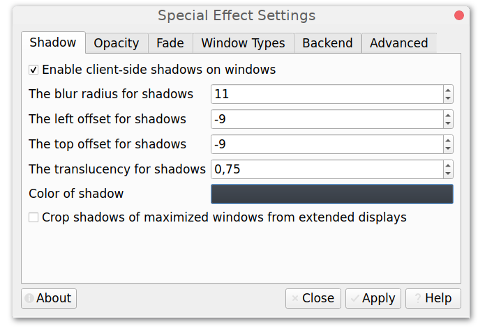
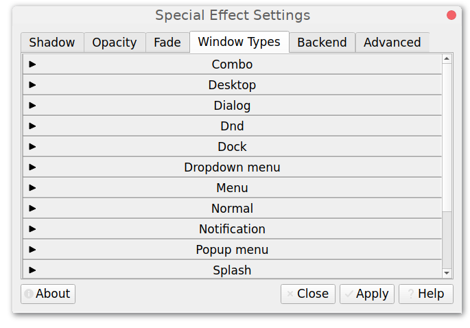

# picom-conf

## Overview

picom-conf is a configuration tool for X composite manager [picom][1].




## Dependencies

Runtime:

- Qt5 base
- [libconfig][2]

Build:

- CMake
- Qt5 Linguist Tools
- Git (optional, to pull latest VCS checkouts)

## Build

`CMAKE_BUILD_TYPE` is usually set to `Release`, though `None` might be a [valid alternative][3].<br>
`CMAKE_INSTALL_PREFIX` has to be set to `/usr` on most operating systems.<br>
Using `sudo make install` is discouraged, instead use the system package manager where possible.

```bash
cmake -B build -D CMAKE_BUILD_TYPE=Release -D CMAKE_INSTALL_PREFIX=/usr -W no-dev
cmake --build build --verbose
DESTDIR="$(pwd)/package" cmake --install build
```

## Packages

[][4]

## Translations

For contributing translations the [LXQt Weblate Platform][5] can be used.

[][6]


[1]: https://github.com/yshui/picom/
[2]: https://github.com/hyperrealm/libconfig/
[3]: https://wiki.archlinux.org/title/CMake_package_guidelines#Fixing_the_automatic_optimization_flag_override
[4]: https://repology.org/project/picom-conf/versions
[5]: https://translate.lxqt-project.org/projects/qtilities/picom-conf/
[6]: https://translate.lxqt-project.org/engage/qtilities/?utm_source=widget
